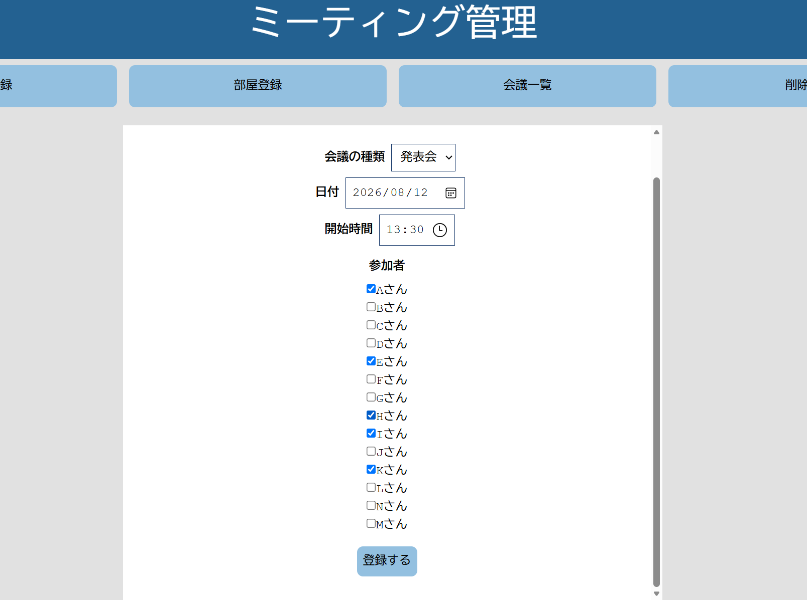

# Meeting-manager

会議を管理するためのアプリケーションです。
Reactとnext.jsで実装しました。

## 機能

- 会議の新規登録
- 部屋は後から登録
- 日付順に会議を並べ替えて表示
- 会議の削除

## デモンストレーション



**Releasesに動画もご用意しております**
([DemoVideo](https://github.com/Nagisa-Ka/meeting-manager/releases/tag/demo-video))

## 使用技術

- JavaScript
- React
- Next.js

## 工夫した点

### 実際の状況を想定

実際に所属しているコミュニティにおける状況を参考に、作成しました。<br/>
状況：会議の「日付や日程、参加者」を係の人が決め、参加者表の末尾の人が「部屋」を予約しに行きます。<br/>
→→→ 部屋の登録だけ後からできるように設計しました。

### 閲覧を分かりやすく

会議は「日付」が早い順、日付が同じ場合は「時間」が早い順に自動的に並び替えられ、表示されるようになっています。

## 今後

- データベースをlocalStorageからSQLiteへ移行
- 参加者の登録・削除機能を実装
- UIの改善（会議の登録、編集、削除、閲覧機能をひとつのページに集約するなど）
- 会議の種類による絞り込み機能を実装

## インストール方法

1. Clone this repository.

```bash
git clone https://github.com/Nagisa-Ka/meeting-manager
```

2. Move to the project directory.

```bash
cd meeting-manager
```

3. Install dependencies.

```bash
npm install
```

4. Start the development server.

```bash
npm run dev
```

5. Open `http://localhost:3000` in your browser.
